# Golden Future Care — Network Infrastructure Website

> Bilingual (Arabic/English RTL+LTR) corporate website for a Saudi network cabling supplier. Built as a full-stack project with Laravel + Filament admin panel + React/Vite frontend.

🌐 **Live demo:** https://gfc-it.com/

> *(The live demo is the React frontend running with mock data. The full Laravel backend powers the same UI when self-hosted.)*

## Screenshots

### Home page
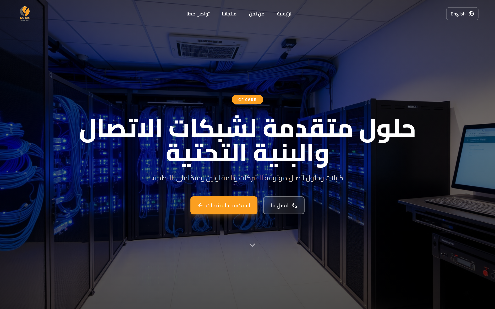
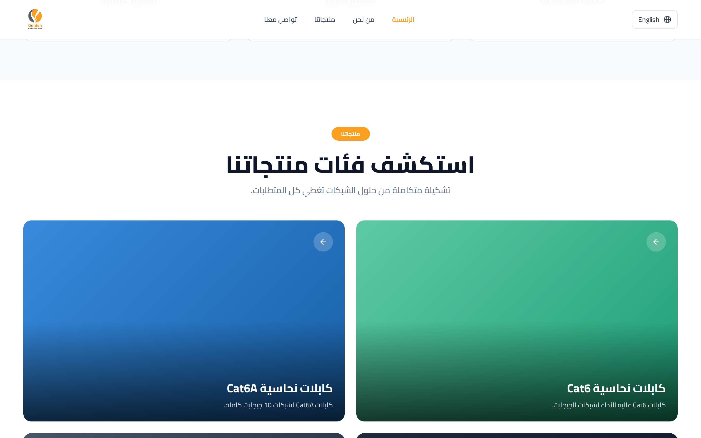
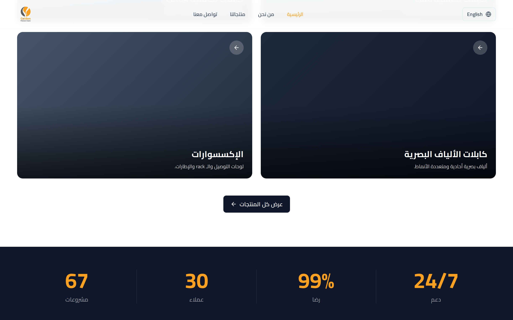
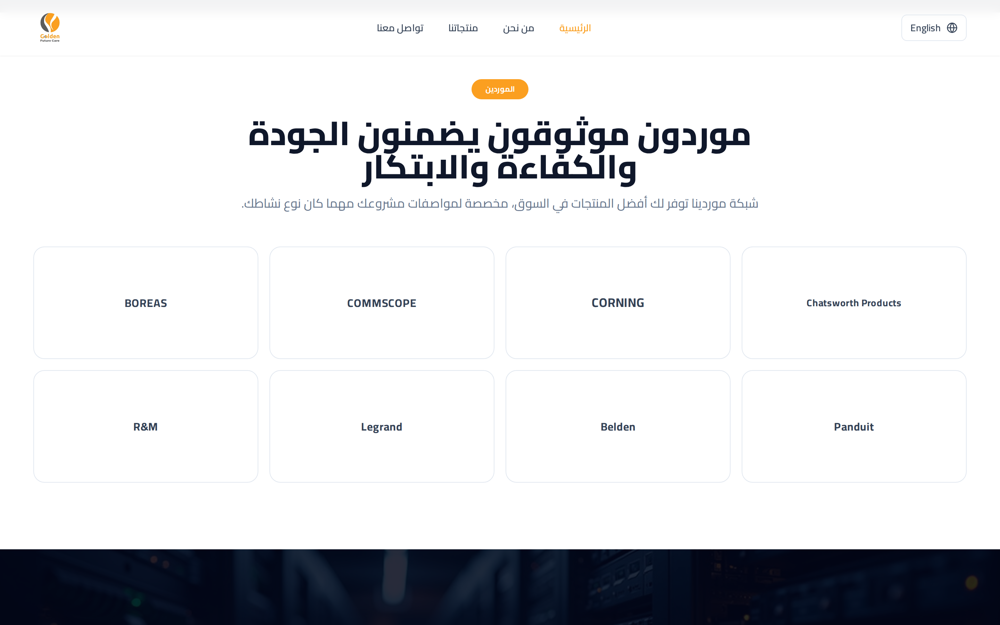

### About page
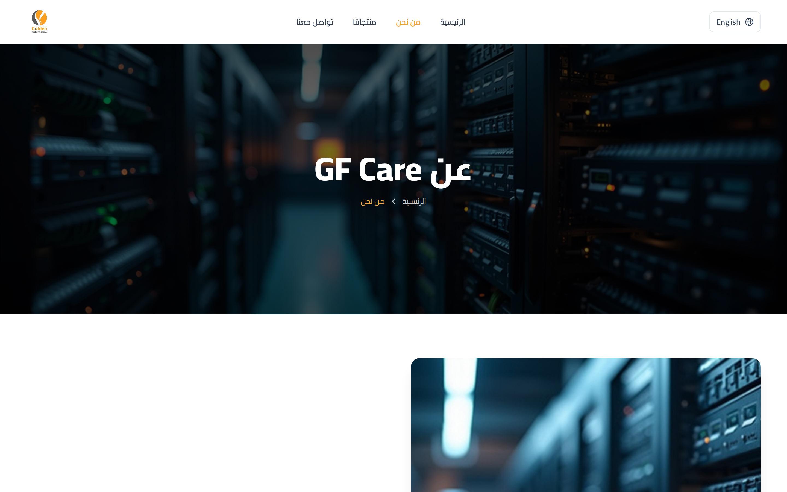
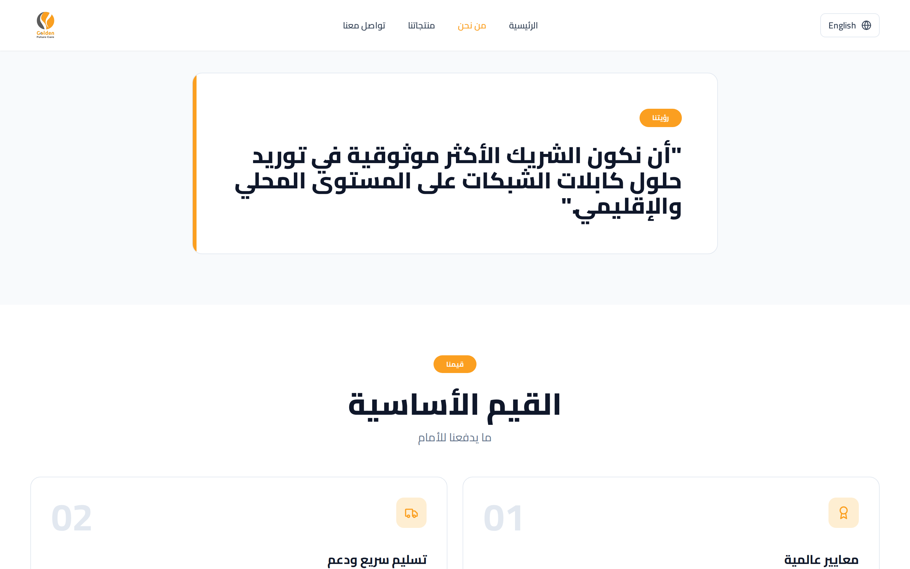
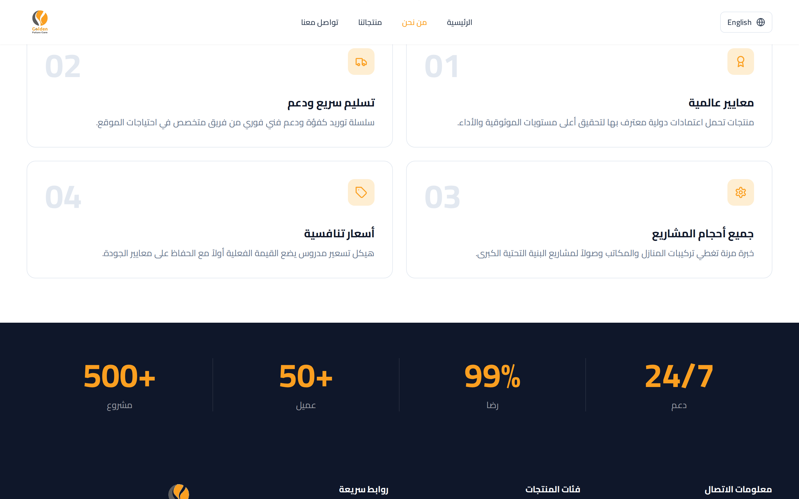

### Products page
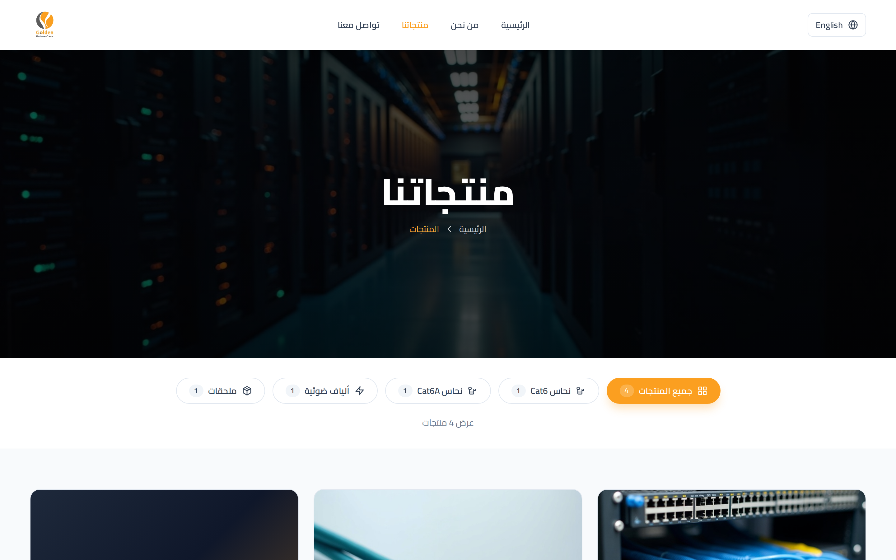
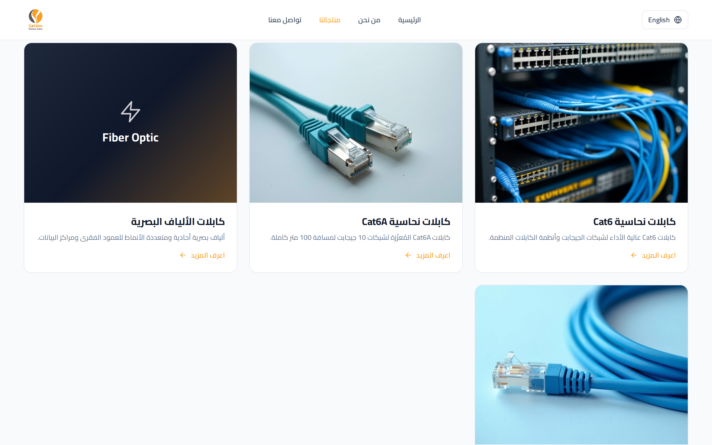

### Contact page
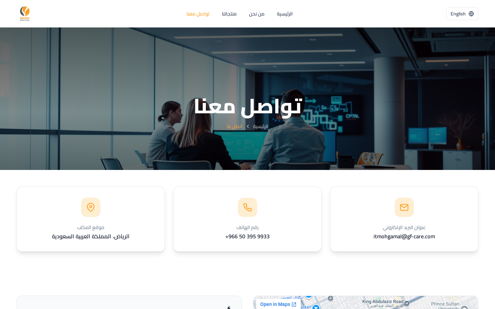
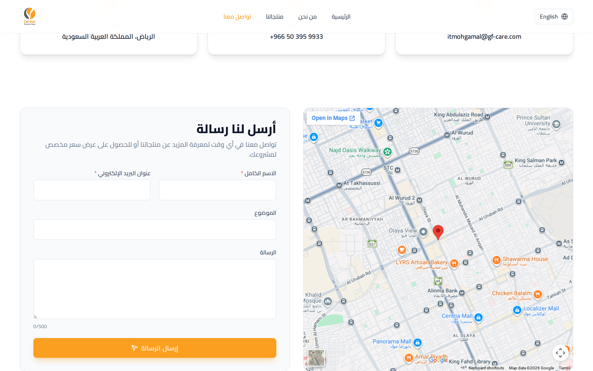

## Tech Stack

**Frontend**
- React 18 with React Router 6
- Vite 5 (build tool)
- Tailwind CSS 3 with custom design tokens
- react-i18next (Arabic/English with RTL)
- framer-motion (animations)
- axios (API client)

**Backend** *(self-hosted only — not part of the GitHub Pages demo)*
- Laravel 11 (PHP 8.3)
- Filament v3 admin panel
- Sanctum API authentication
- Spatie Translatable for bilingual content
- MySQL 8 / MariaDB 10.11

## Highlights

- **Bilingual & RTL** — full Arabic and English with proper right-to-left layout flipping
- **Headless architecture** — React frontend talks to Laravel via REST API
- **Custom admin panel** — site owner can edit all content (services, suppliers, projects, settings) without touching code
- **Design system** — primary brand color `#FB9F20` with full Tailwind palette, Cairo + Plus Jakarta Sans typography
- **Responsive** — mobile, tablet, desktop layouts
- **Demo-ready** — same React code runs against live Laravel API or static mock data via env flag

## Project Structure

```
gfc-website/
├── backend/                  # Laravel 11 API + Filament admin
│   ├── app/Http/Controllers/Api/
│   ├── app/Filament/Resources/
│   ├── app/Models/
│   ├── database/migrations/
│   └── database/seeders/
│
├── frontend/                 # React + Vite SPA
│   ├── src/
│   │   ├── pages/            # Home, About, Services, Contact, ...
│   │   ├── components/
│   │   │   ├── sections/     # Hero, AboutPreview, Features, Stats, ...
│   │   │   ├── Header.jsx
│   │   │   └── Footer.jsx
│   │   ├── lib/
│   │   │   ├── api.js        # axios client (real or mock based on env)
│   │   │   └── mockData.js   # static demo data
│   │   └── locales/          # ar.json, en.json
│   └── public/images/        # hero/product photos, logo
│
├── .github/workflows/
│   └── deploy.yml            # GitHub Pages auto-deploy
│
└── SETUP.md                  # full local setup guide
```

## Running Locally

### Demo mode (frontend only — no backend needed)

```bash
cd frontend
npm install --legacy-peer-deps
VITE_USE_MOCK=true npm run dev
# → http://localhost:5173
```

### Full stack (Laravel + React + MySQL)

See **[SETUP.md](SETUP.md)** for the complete walkthrough.

```bash
# Backend
cd backend && composer install && cp .env.example .env
php artisan key:generate && php artisan migrate --seed
php artisan serve

# Frontend (in another terminal)
cd frontend && npm install --legacy-peer-deps && npm run dev
```

Admin panel: `http://localhost:8000/admin` (default: `admin@gfc-it.com` / `ChangeMe!2026`)

## Deploying to GitHub Pages

This repo is configured to auto-deploy the React frontend to GitHub Pages on every push to `main`.

1. **Push to GitHub** as a public repo named e.g. `gfc-website`
2. In repo **Settings → Pages**, set source to **GitHub Actions**
3. Push any change to `main` — the workflow in `.github/workflows/deploy.yml` builds and publishes
4. Site available at `https://YOUR_USERNAME.github.io/gfc-website/`

The workflow sets `VITE_USE_MOCK=true` so the frontend uses bundled demo data instead of calling Laravel.

## License

This project structure and code are presented as a portfolio piece. Brand assets (logo, contact info, supplier names) belong to their respective owners and are used here for demonstration purposes.

---

**Built by [Amr](https://github.com/YOUR_USERNAME)** — شريك الأعمال لتقنية المعلومات
